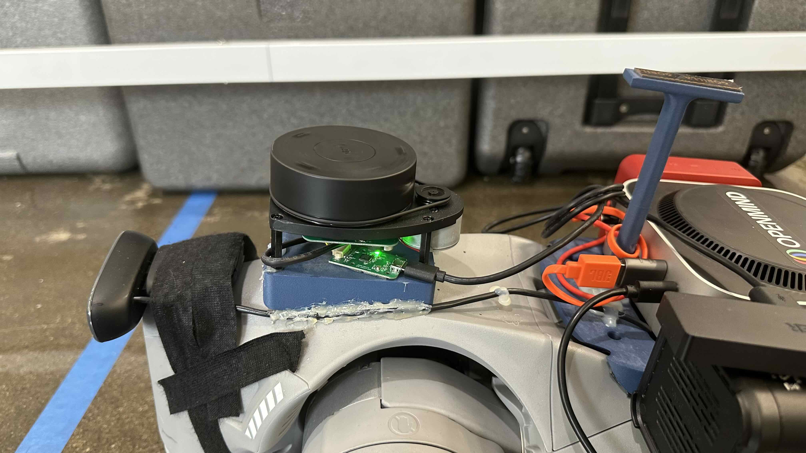
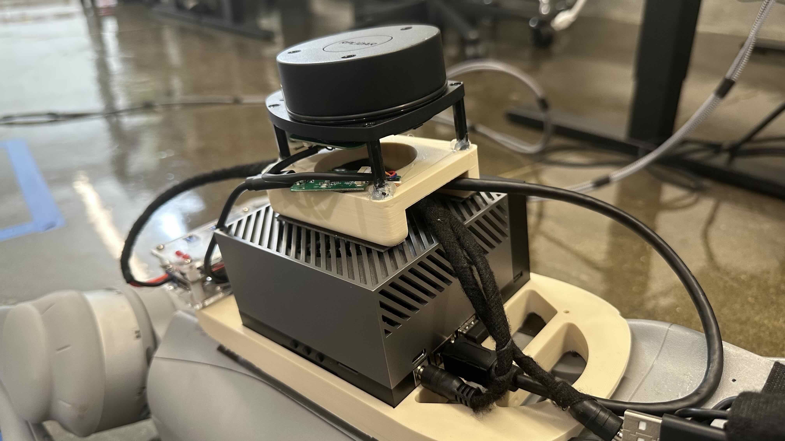

# Unitree Go2 SDK

A ROS 2 package that provides SLAM (Simultaneous Localization and Mapping) capabilities for the Unitree Go2 robot using an RPLiDAR sensor, the SLAM Toolbox and the Nav2 stack.

## Overview

This package integrates:
- **RPLiDAR** for laser scanning
- **SLAM Toolbox** for mapping and localization
- **Nav2** for autonomous navigation
- **Transform broadcasting** for robot pose integration
- **RViz visualization** for real-time monitoring

## Features

- **Real-time SLAM**: Simultaneous localization and mapping using SLAM Toolbox
- **RPLiDAR Integration**: Support for RPLiDAR A1/A2/A3 series sensors
- **Navigation**: Integration with Nav2 for autonomous navigation
- **Robot Control**: Direct integration with Unitree Go2 movement commands
- **Visualization**: Pre-configured RViz setup for monitoring
- **Transform Management**: Automatic handling of coordinate frame transforms

## Prerequisites

- ROS 2 Humble
- Python 3.10+
- RPLiDAR connected via USB (typically `/dev/ttyUSB0`)

## Installation

### 0. Hardware setup:

We provide two options for placing the RPLiDAR on the Unitree Go2 robot:
   - **Option 1**: Mount the RPLiDAR on the head of the robot using a 3D-printed mount.

     

   - **Option 2**: Mount the RPLidar at the center of the robot using a 3D-printed mount.

     

You can find the 3D model for the mount in the `models` directory of this repository.

### 1. Clone this repository into your ROS 2 workspace:

```bash
cd ~/ros2_ws/src
git clone https://github.com/OpenmindAGI/unitree_go2_ros2_sdk.git
```

### 2. Install dependencies:

```bash
cd ~/ros2_ws
rosdep install --from-paths . --ignore-src -r -y
```

### 3. Install Python dependencies:
```bash
pip install -r requirements.txt
```

### 4. Build the packages:

```bash
colcon build --packages-select unitree_api go2_sdk
```

### 5. Source the workspace:

```bash
source install/setup.bash
```

### 6. Set up RPLiDAR permissions:

```bash
# Option 1: Temporary permission (needs to be run each time)
sudo chmod 777 /dev/ttyUSB0

# Option 2: Add user to dialout group (permanent, requires logout/login)
sudo usermod -a -G dialout $USER

# Option 3: Create udev rule (permanent)
echo 'KERNEL=="ttyUSB*", ATTRS{idVendor}=="10c4", ATTRS{idProduct}=="ea60", GROUP="dialout", MODE="0666"' | sudo tee /etc/udev/rules.d/99-rplidar.rules
sudo udevadm control --reload-rules && sudo udevadm trigger
```

## Usage

### Launch SLAM System

To start the complete SLAM system:

```bash
ros2 launch go2_sdk slam_launch.py
```

Once you have done the mapping, you can save the map through the RViz2 interface by clicking on the `Save Map` button and the `Serialize Map` in the `SlamToolboxPlugin` panel.

### Launch Navigation System
To start the navigation system with SLAM:

```bash
ros2 launch go2_sdk nav_launch.py map_yaml_file:=<path_to_your_map_yaml_file>
```

### Launch with Custom Parameters

You can customize RPLiDAR and other parameters:

```bash
ros2 launch go2_sdk slam_launch.py \
    serial_port:=/dev/ttyUSB0 \
    serial_baudrate:=115200 \
    frame_id:=laser \
    scan_mode:=Sensitivity
```

### Control the Robot

Once SLAM is running, you can control the robot using:

```bash
# Using keyboard teleop (install first: sudo apt install ros-humble-teleop-twist-keyboard)
ros2 run teleop_twist_keyboard teleop_twist_keyboard

# Or publish velocity commands directly
ros2 topic pub /cmd_vel geometry_msgs/Twist '{linear: {x: 0.5, y: 0.0, z: 0.0}, angular: {x: 0.0, y: 0.0, z: 0.0}}'
```

### Visualize in RViz

Launch RViz with the provided configuration:

```bash
rviz2 -d config/rviz.rviz
```

## Troubleshooting

### RPLiDAR Connection Issues

1. Check USB connection:
```bash
ls -la /dev/ttyUSB*
```

2. Verify permissions:
```bash
sudo chmod 777 /dev/ttyUSB0
```

3. Add user to dialout group:
```bash
sudo usermod -a -G dialout $USER
```

### SLAM Performance Issues

- Reduce `scan_buffer_size` if experiencing dropped messages
- Adjust `correlation_search_space_dimension` for better loop closure
- Modify `loop_search_maximum_distance` based on environment size

### Transform Issues

- Ensure all required transforms are being published
- Check TF tree with: `ros2 run tf2_tools view_frames`
- Verify timing with: `ros2 topic echo /tf`

### Robot Control Issues

- Verify cmd_vel messages are being published: `ros2 topic echo /cmd_vel`
- Ensure the robot is in the correct mode for receiving movement commands

### Timestamp Issues

The ROS topic timestamps from the Unitree Go2 are 12 seconds behind the current system time. Please disable your computer’s `Automatic Date & Time` setting and manually sync the timestamp using:

```
sudo date -s "@unix"
```

You can find the timestamp from the Unitree Go2 by running:

```
ros2 topic echo /utlidar/robot_pose --field header.stamp
```
